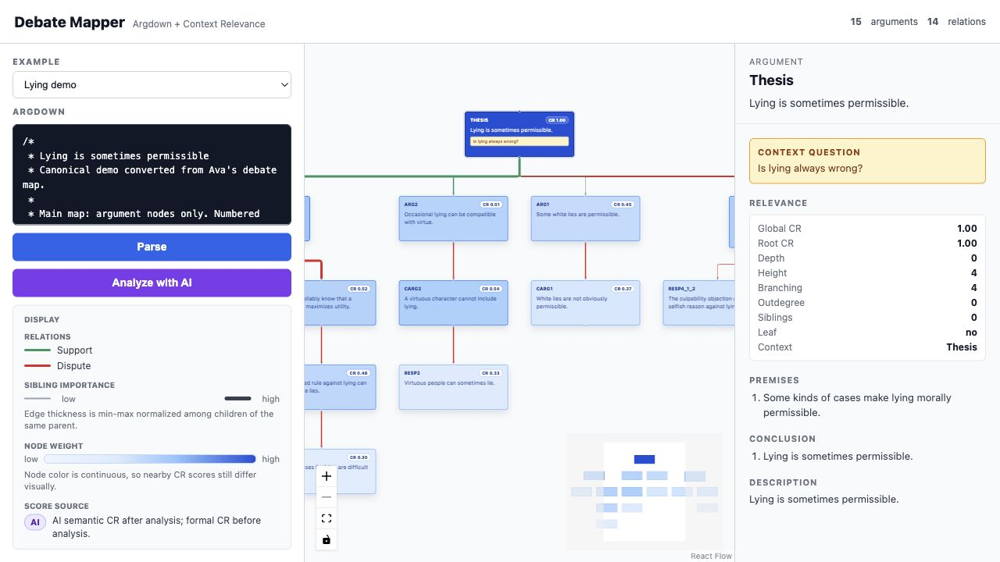

# Debate Mapper

Debate Mapper is a text-first prototype for turning Argdown into an interactive argument map. It keeps the text as the source of truth, then renders a graph for exploring support/dispute relations, formal Context Relevance (CR), and optional AI semantic relevance.

## Screenshot



## What It Does

- Parses Argdown into an argument-level debate map.
- Keeps premises, conclusions, and descriptions inside each argument node.
- Shows support and dispute relations between arguments.
- Computes formal CR from graph structure as the default score.
- Uses continuous blue node color for node weight, from low CR to high CR.
- Normalizes edge thickness among sibling arguments under the same parent.
- Shows selected argument details, including relevance features and inner structure.
- Optionally asks an AI model for semantic CR and mismatch notes.

## Scoring

Before AI analysis, the graph uses formal CR:

- Node color uses each node's global CR.
- Edge thickness uses each edge's local CR, min-max normalized among children of the same parent.
- The context root has CR `1.00` in its own context.

When AI analysis runs, `/api/llm-score` asks the configured model for semantic relevance. The graph then uses:

- `nodes[title].semanticScore` for node weight.
- `edges["from=>to:type"].semanticLocalScore` for edge weight.

Formal scores remain available in the details panel for comparison.

## Run Locally

Install dependencies:

```bash
npm install
cd server && npm install
cd ../client && npm install
```

Start the API server:

```bash
cd server
npm run dev
```

Start the Vite client in another terminal:

```bash
cd client
npm run dev
```

Open `http://localhost:5173`.

## AI Analysis Config

Create a `.env` file at the project root with Azure OpenAI settings:

```env
AZURE_OPENAI_ENDPOINT=
AZURE_OPENAI_API_KEY=
AZURE_OPENAI_API_VERSION=
AZURE_OPENAI_DEPLOYMENT_NAME=
```

Parsing works without these values. **Analyze with AI** requires them.

## Troubleshooting

`Failed to fetch` usually means the client could not reach the API server. Make sure the server is running on `http://localhost:3003`, then check `http://localhost:3003/api/health`.

If parsing works but AI analysis fails, check the Azure OpenAI values in `.env` and the deployment name used by the server.

## Verification

Build the client:

```bash
cd client
npm run build
```

Run the parser smoke test:

```bash
node test.js
```
